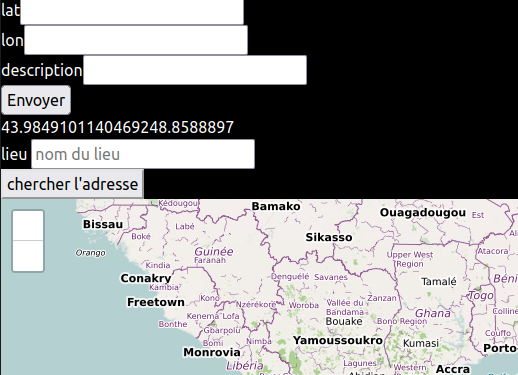

 mkdir -p ~/path/to/venv
 python3 -m venv ~/path/to/venv
 source ~/path/to/venv/bin/activate

- faire python3 Scriptpython.py
- une fois que tu as fini 
- vas dans list reop et fais . pleasecopynow**.sh
- ATTENTION : fais . pleasecopynow**.sh , NE FAIS PAS sh pleasecopynow**.sh
- First, ensure your script begins with the correct hash-bang, eg #!/bin/bash Then make sure the .sh file is executable

qu'est-ce que ce projet
-

- comme dans rails, tu peux choisir des champs, telephone, email, date, time, datetime, password, etc. il y a comme un form helper et le code html est écrit dans la page
- tu peux ajouter des lunettes sur un visage, du maquillage, reconnaitre quelqu'un (un login facial)
